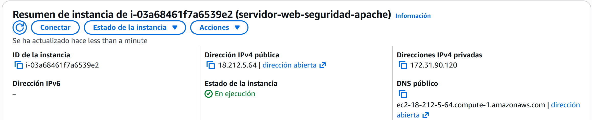
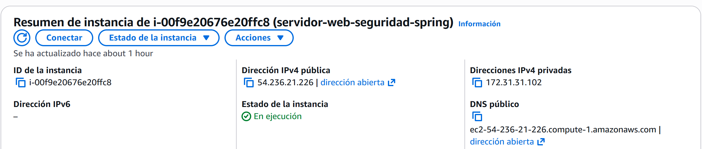
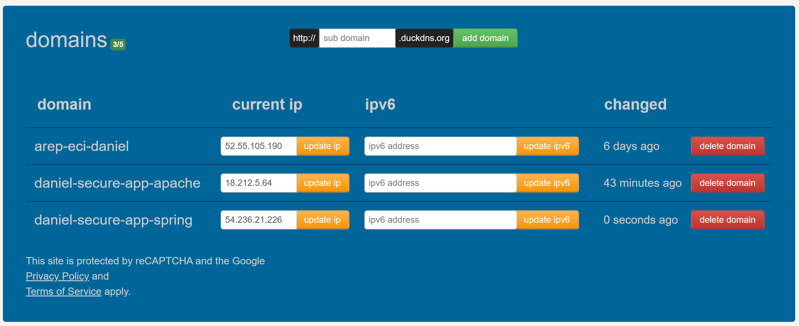
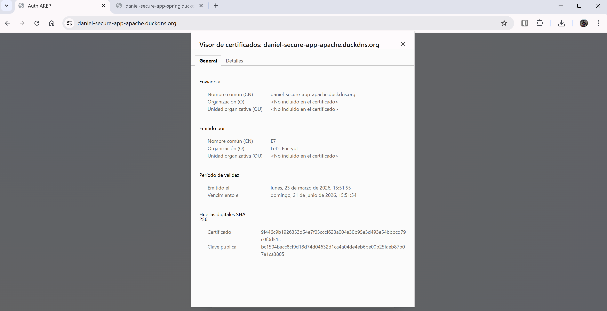
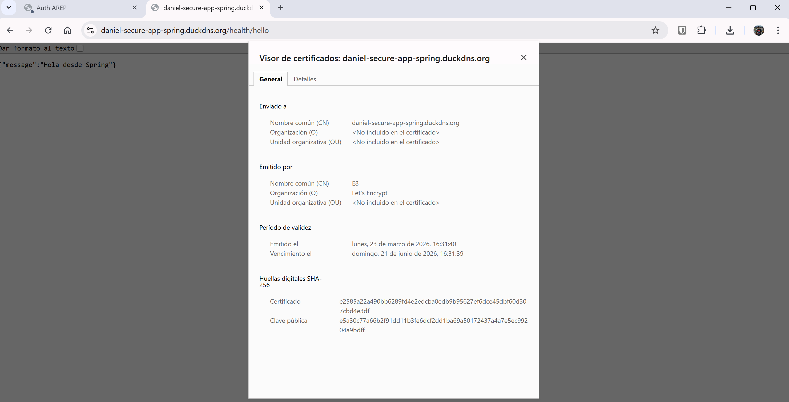
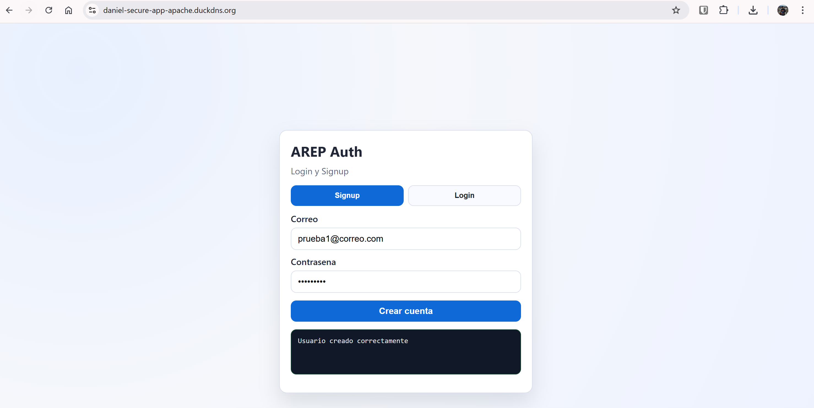
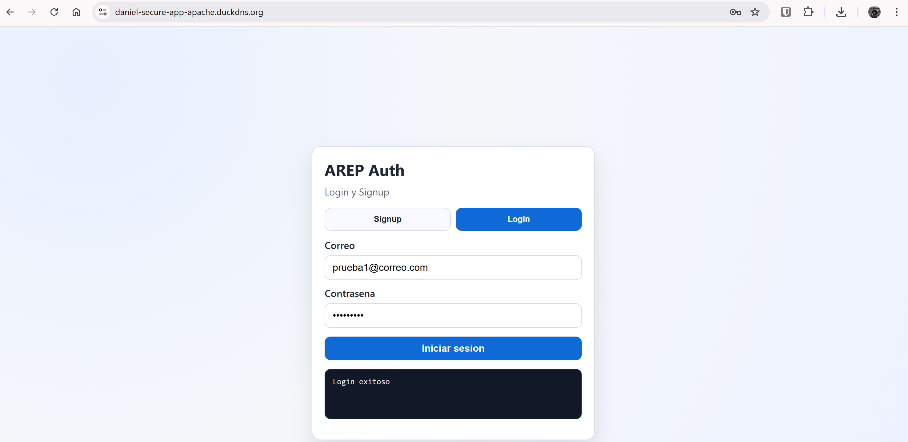
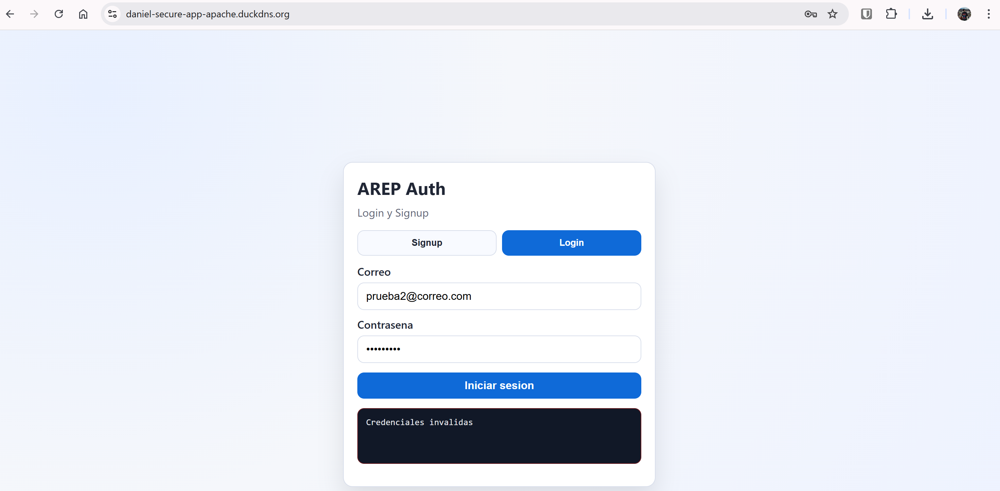

# AREP Server Web Security

Aplicacion web segura con frontend asincrono (HTML + CSS + JS), backend Spring Boot y MongoDB, desplegada en AWS con Apache y Spring en instancias separadas, ambas con TLS de Let's Encrypt.

## 1. Objetivo del Proyecto

Implementar y desplegar una aplicacion segura que cumpla:

- Login y signup con almacenamiento de contrasenas en hash.
- Cliente web asincrono consumiendo API REST.
- Separacion de responsabilidades entre Apache (cliente) y Spring (API).
- TLS en ambos servidores (Apache y Spring) con certificados Let's Encrypt.

## 2. Arquitectura

### Componentes

- Servidor 1 (Apache): publica el cliente estatico.
- Servidor 2 (Spring Boot + MongoDB): expone API REST segura y persiste usuarios.
- Cliente web: formulario de signup/login que consume endpoints HTTPS de Spring.

### Flujo

1. Usuario entra por HTTPS al dominio de Apache.
2. El navegador carga el cliente web (HTML/CSS/JS).
3. El JS invoca por HTTPS la API de Spring (otro dominio/subdominio).
4. Spring valida, hashea y guarda/consulta usuarios en MongoDB.

## 3. Estructura del Backend

- `controller`: controladores REST.
- `service`: logica de negocio.
- `repository`: acceso a MongoDB.
- `model`: entidades de dominio.
- `dto`: contratos de entrada/salida.
- `config`: configuracion transversal (password encoder y CORS).
- `exception`: errores de dominio.

## 4. Seguridad Implementada

### 4.1 Hash de Contrasenas

- Se usa `BCryptPasswordEncoder` para almacenar hash, no texto plano.
- En login se compara con `passwordEncoder.matches(...)`.

### 4.2 CORS Controlado

- Se permite origen del frontend Apache para consumir la API cross-domain.

### 4.3 TLS en Ambos Servidores

- Apache: certificado Let's Encrypt para descarga segura del cliente.
- Spring: certificado Let's Encrypt convertido a PKCS12 y cargado por Spring.

## 5. Endpoints REST

### Signup

- `POST /auth/signup`

Body:

```json
{
  "email": "usuario@correo.com",
  "password": "ClaveSegura123"
}
```

### Login

- `POST /auth/login`

Body:

```json
{
  "email": "usuario@correo.com",
  "password": "ClaveSegura123"
}
```

### Health Check

- `GET /health/hello`

Respuesta esperada:

```json
{
  "message": "Hola desde Spring"
}
```

## 6. Frontend Asincrono

Cliente en carpeta [apache](apache) con:

- [apache/index.html](apache/index.html)
- [apache/styles.css](apache/styles.css)
- [apache/app.js](apache/app.js)

`app.js` consume el backend en:

- `https://daniel-secure-app-spring.duckdns.org`

## 7. Despliegue AWS (Resumen)

### 7.1 Servidor Apache (Instancia 1)

1. Instalar Apache.
2. Copiar frontend al `DocumentRoot` (`/var/www/html`).
3. Emitir certificado Let's Encrypt para dominio Apache.
4. Servir cliente por HTTPS.

### 7.2 Servidor Spring + Mongo (Instancia 2)

1. Instalar Docker y Docker Compose.
2. Emitir certificado Let's Encrypt para dominio Spring.
3. Convertir `fullchain.pem` + `privkey.pem` a `ecikeystore.p12`.
4. Levantar `docker compose` con montaje de keystore y Mongo.

Archivo de orquestacion:

- [docker-compose.yml](docker-compose.yml)

## 8. Ejecucion con Docker Compose

Desde la raiz del proyecto:

```bash
docker compose up -d --build
docker compose ps
```

Para reconstruir y reiniciar:

```bash
docker compose down
docker compose up -d --build
```

## 9. Evidencias de Prueba

### 9.1 Infraestructura y DNS

- IP publica de la instancia Apache:



- IP publica de la instancia Spring:



- Configuracion del subdominio en DuckDNS:



### 9.2 Certificados TLS

- Certificado HTTPS valido en servidor Apache:



- Certificado HTTPS valido en servidor Spring:



### 9.3 Pruebas Funcionales de Autenticacion

- Registro de usuario (`POST /auth/signup`) exitoso:



- Login exitoso con credenciales validas:



- Login fallido con credenciales invalidas:



### 9.4 Video

[Video demostrativo](https://www.loom.com/share/6db933c82ed54c30a2040beb61542489)
